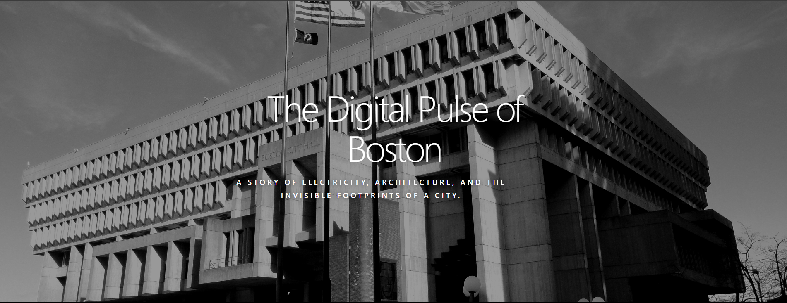

# The Digital Pulse of Boston



Interactive energy dashboard visualizing electricity usage at Boston City Hall.

**Live Site:** [https://avanith12.github.io/The-Digital-Pulse-of-Boston/](https://avanith12.github.io/The-Digital-Pulse-of-Boston/)

## What is this?
Behind the massive concrete walls of City Hall, electricity flows in patterns that tell a story. This dashboard decodes those patterns into three main views:

- **Seasonal Shifts**: How the building battles the New England summer heat.
- **Weekly Rhythms**: The clear difference between the busy workweek and quiet weekends.
- **Daily Heartbeat**: A 24-hour profile of the building "waking up" and settling down.

## Features
- Interactive charts with monthly, weekly, and hourly energy patterns
- Real-time peak and average power demand metrics
- Processes 100,000+ electricity readings collected every 15 minutes

## Key Insights
The data reveals fascinating patterns about Boston City Hall's energy consumption:

- **Summer Peak**: Highest demand in July and August due to cooling requirements during Boston's humid summers
- **Workweek Pattern**: Clear distinction between weekday operations (Monday-Friday) and weekend low-power states
- **Daily Cycle**: Building "wakes up" at 6:00 AM, peaks around 2:00 PM, but never fully shuts down
- **Baseline Consumption**: Even at 3:00 AM, the building maintains constant energy consumption, showing the cost of keeping modern infrastructure operational

## Data
- **Format**: CSV (Comma-separated values)
- **Time Period**: October 27, 2016 to March 26, 2020
- **Interval**: 15-minute electricity demand readings
- **Columns**:
  - `DateTime_Measured` - Timestamp of the measurement (YYYY-MM-DD HH:MM:SS)
  - `Total_Demand_KW` - Total electricity demand in kilowatts
- **Source**: [City Hall Electricity Usage](https://data.boston.gov/dataset/city-hall-electricity-usage) from Analyze Boston

## Technologies Used
* HTML5 & CSS Grid
* Vanilla JavaScript
* Chart.js

## Project Structure
```
The-Digital-Pulse-of-Boston/
├── index.html
├── style.css
├── script.js
├── data.csv
├── hero.png
├── readme.png
├── analysis.py
├── LICENSE
└── README.md
```

## Credits
- **Data**: [City Hall Electricity Usage](https://data.boston.gov/dataset/city-hall-electricity-usage) from Analyze Boston.
- **Image**: [Wikimedia Commons](https://commons.wikimedia.org/wiki/File:Boston_City_Hall_-_Boston,_MA_-_DSC04704_(cropped).JPG).

## Setup
1. Use the **Live Server** extension in VS Code.
2. (Or) Run `python3 -m http.server` and open `http://localhost:8000`.

## Usage
Once the dashboard is loaded:
- **View Metrics**: Check the peak and average power demand displayed at the top
- **Explore Charts**: Hover over the monthly, weekly, and hourly charts to see detailed values
- **Read Insights**: Scroll through the narrative sections to understand the energy patterns
- **Responsive Design**: The dashboard adapts to different screen sizes for optimal viewing

## Troubleshooting

### Why a local server is needed
The dashboard requires a local web server due to **CORS (Cross-Origin Resource Sharing)** restrictions. Browsers block local file access to prevent security issues, so opening `index.html` directly won't load the CSV data. Using a local server (Live Server, Python's http.server, etc.) allows the browser to fetch the `data.csv` file properly.

### Charts not loading
If the charts don't appear:
1. **Check browser console** (F12) for any error messages
2. **Verify data.csv exists** in the project directory
3. **Ensure you're using a local server** - don't open the HTML file directly
4. **Check internet connection** - Chart.js is loaded from a CDN
5. **Try refreshing** the page after the server starts

## License
This project is licensed under the MIT License - see the [LICENSE](LICENSE) file for details.

---
This was a fun project to explore data storytelling. I used AI to help with my understanding and to refine the implementation.

**Made by Avanith Kanamarlapudi!**
